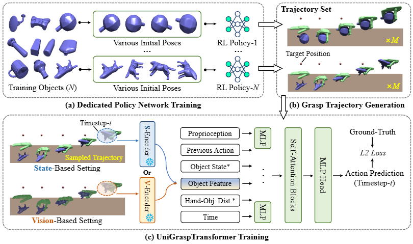

# <p align="center"> UniGraspTransformer: Simplified Policy Distillation for Scalable Dexterous Robotic Grasping </p>

### <p align="center"> Microsoft Research Asia </p>

### <p align="center">[ArXiv](https://arxiv.org/abs/2412.02699) | [Website](https://dexhand.github.io/UniGraspTransformer/)

<p align="center">
  
</p>
We introduce UniGraspTransformer, a universal Transformer-based network for dexterous robotic grasping that simplifies training while enhancing scalability and performance. Unlike prior methods such as UniDexGrasp++, which require complex, multi-step training pipelines, UniGraspTransformer follows a streamlined process: first, dedicated policy networks are trained for individual objects using reinforcement learning to generate successful grasp trajectories; then, these trajectories are distilled into a single, universal network. Our approach enables UniGraspTransformer to scale effectively, incorporating up to 12 self-attention blocks for handling thousands of objects with diverse poses. Additionally, it generalizes well to both idealized and real-world inputs, evaluated in state-based and vision-based settings. Notably, UniGraspTransformer generates a broader range of grasping poses for objects in various shapes and orientations, resulting in more diverse grasp strategies. Experimental results demonstrate significant improvements over state-of-the-art, UniDexGrasp++, across various object categories, achieving success rate gains of 3.5%, 7.7%, and 10.1% on seen objects, unseen objects within seen categories, and completely unseen objects, respectively, in the vision-based setting.
</p>

# I. Released
- [x] Code for training and testing.
- [x] Pre-trained models for isaacgym3.
- [ ] Pre-trained models for isaacgym4.

# II. Get Started
## Folder Structure:
```
PROJECT
    └── Logs
        └── Results
            └── results_train
            └── results_distill
            └── results_trajectory
    └── Assets
        └── datasetv4.1_posedata.npy
        └── meshdatav3_pc_feat
        └── meshdatav3_pc_fps
        └── meshdatav3_scaled
        └── meshdatav3_init
        └── textures
        └── mjcf
        └── urdf
    └── isaacgym3
    └── isaacgym4
    └── UniGraspTransformer
        └── results
        └── dexgrasp
```

## Install Environment:
Create conda env:
```
conda create -n dexgrasp python=3.8
conda activate dexgrasp
```

Install isaacgym3 as used in our paper:
```
cd PROJECT/isaacgym3/isaacgym3/python
pip install -e .
```

Install UniGraspTransformer:
```
cd PROJECT/UniGraspTransformer
bash install.sh
```
Driver 550.107.02; Cuda 11.6; Ubuntu 20.04

## Download Assets:
Download meshdatav3_pc_feat.zip, meshdatav3_pc_fps.zip and meshdatav3_scaled.tar.xz from [UniDexGrasp++](https://mirrors.pku.edu.cn/dl-release/UniDexGrasp_CVPR2023/dexgrasp_policy/assets/).

Download meshdatav3_init.zip from [here](https://drive.google.com/file/d/14InPt0JFm6UNc-bdWCa4NkOVtATi-_M6/view?usp=sharing).
Download datasetv4.1_posedata.npy from [here](https://drive.google.com/file/d/1DajtOFyTPC5YhsO-Fd3Gv17x7eAysI1b/view).


# III. Train from scratch
## Step1: Train Dedicated Policy:
```
cd PROJECT/UniGraspTransformer/dexgrasp/
```

Train&Test dedicated policy for single $nline=0 object in $Object_File=train_set_results.yaml:
```
python run_online.py --task StateBasedGrasp --algo ppo --seed 0 --rl_device cuda:0 \
    --num_envs 1000 --max_iterations 10000 --config dedicated_policy.yaml --headless \
    --object_scale_file train_set_results.yaml --start_line 0 --end_line 1
python run_online.py --task StateBasedGrasp --algo ppo --seed 0 --rl_device cuda:0 \
    --num_envs 1000 --max_iterations 10000 --config dedicated_policy.yaml --headless --test --test_iteration 1 \
    --object_scale_file train_set_results.yaml --start_line 0 --end_line 1
```

## Step2: Generate Trajectory Dataset:
Generate trajectories for single $nline=0 object in $Object_File=train_set_results.yaml:
```
python run_online.py --task StateBasedGrasp --algo ppo --seed 0 --rl_device cuda:0 \
    --num_envs 100 --max_iterations 10000 --config dedicated_policy.yaml --headless --test --test_iteration 10 \
    --object_scale_file train_set_results.yaml --start_line 0 --end_line 1 --save --save_train --save_render
```
**Script:** Repeat step1 and step2 for multiple $nline objects, like from 0 to 9:
```
bash run_online_parallel.sh 0 9 10 dedicated_policy.yaml train_set_results.yaml
```

## Step3: Train Universal Policy:
Train state-based and vision-based universal policies on objects 0~9:
```
python run_offline.py --start 0 --finish 9 --config universal_policy_state_based.yaml --object train_set_results.yaml --device cuda:0
python run_offline.py --start 0 --finish 9 --config universal_policy_vision_based.yaml --object train_set_results.yaml --device cuda:0
```
Test state-based universal policy on $nline=0 object.
```
python run_online.py --task StateBasedGrasp --algo dagger_value --seed 0 --rl_device cuda:0 \
--num_envs 1000 --max_iterations 10000 --config universal_policy_state_based.yaml --headless --test --test_iteration 1 \
--model_dir distill_0000_0009 --object_scale_file train_set_results.yaml --start_line 0 --end_line 1
```
Test vision-based universal policy on $nline=0 object.
```
python run_online.py --task StateBasedGrasp --algo dagger_value --seed 0 --rl_device cuda:0 \
--num_envs 1000 --max_iterations 10000 --config universal_policy_vision_based.yaml --headless --test --test_iteration 1 \
--model_dir distill_0000_0009 --object_scale_file train_set_results.yaml --start_line 0 --end_line 1
```
**Script:** Train&test state-based and vision-based universal policies on objects 0~9:
```
bash run_offline_parallel.sh 0 9 10 universal_policy_state_based.yaml train_set_results.yaml
bash run_offline_parallel.sh 0 9 10 universal_policy_vision_based.yaml train_set_results.yaml
```

# IV. Test pre-trained models (IsaacGym3)
## Test State-based Universal Policy:
Test pre-trained state-based universal policy on train, test_seen_cat, and test_unseen_cat:
```
bash run_offline_parallel.sh 0 3199 3199 universal_policy_state_based.yaml train_set_results.yaml distill_0000_3199
bash run_offline_parallel.sh 0 139 140 universal_policy_state_based.yaml test_set_seen_cat_results.yaml distill_0000_3199
bash run_offline_parallel.sh 0 99 100 universal_policy_state_based.yaml test_set_unseen_cat_results.yaml distill_0000_3199
```
## Test Vision-based Universal Policy:
Test pre-trained vision-based universal policy on train, test_seen_cat, and test_unseen_cat:
```
bash run_offline_parallel.sh 0 3199 3199 universal_policy_vision_based.yaml train_set_results.yaml distill_0000_3199
bash run_offline_parallel.sh 0 139 140 universal_policy_vision_based.yaml test_set_seen_cat_results.yaml distill_0000_3199
bash run_offline_parallel.sh 0 99 100 universal_policy_vision_based.yaml test_set_unseen_cat_results.yaml distill_0000_3199
```

# V. Test pre-trained models (IsaacGym4)
## Install IsaacGym4
Please download IsaacGym4 from [Nvidia](https://developer.nvidia.com/isaac-gym/download).

## Download Pre-trained Dedicated Policies:
Please download 3,015 pre-trained dedicated polcies from [here](https://drive.google.com/file/d/1ikAD848ZqRRrGaQyg_Xy5YVpNaXE40qX/view?usp=sharing).
(The left 185 training objects cannot be loaded in IsaacGym4).

## Test&Render&Generate Trajectories using Dedicated Policies:
Test, Render, and Generate Trajectories using pre-trained dedicated policies on train objects 0~99:
```
bash run_online_parallel.sh 0 99 100 dedicated_policy.yaml train_set_results.yaml
```

## Train&Test State-based and Vision-based Universal Policies:
Train&Test state-based and vision-based universal policies on objects 0~99:
```
bash run_offline_parallel.sh 0 99 100 universal_policy_state_based.yaml train_set_results.yaml
bash run_offline_parallel.sh 0 99 100 universal_policy_vision_based.yaml train_set_results.yaml
```

## Download Pre-trained Universal Policies:
# # Comming Soon!
